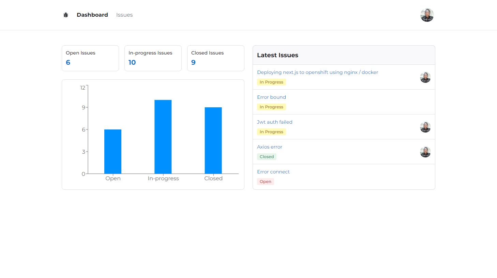
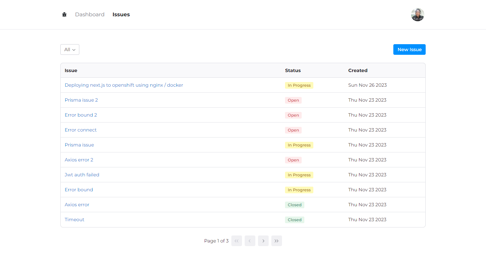
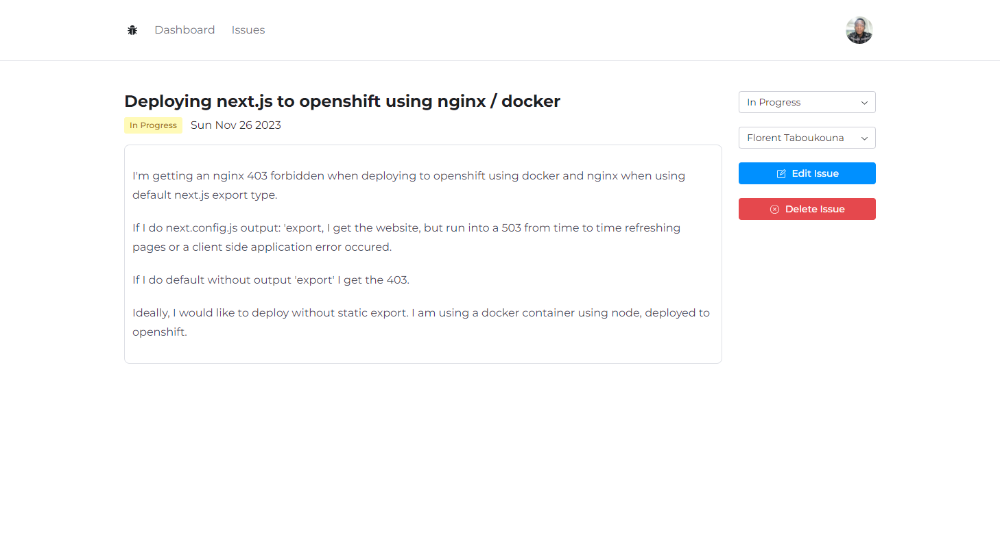
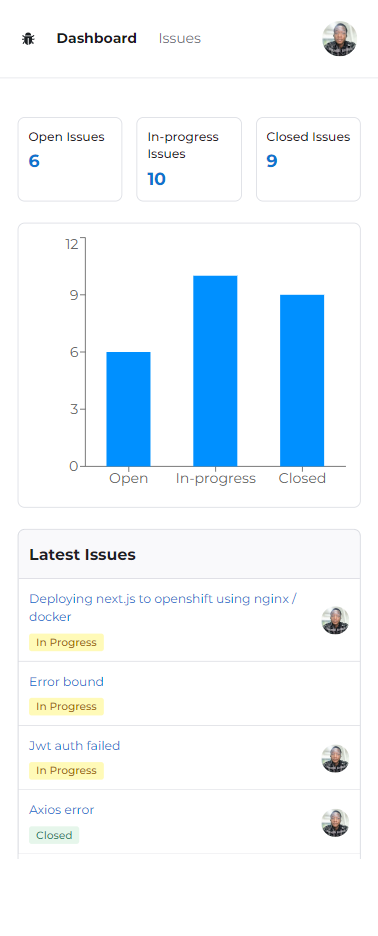

# Issue Tracker

**Issue Tracker** is a modern, full-featured, production-grade issue tracking application built with Next.js (app router), Tailwind, Radix UI, Prisma, and NextAuth.js.

## Screenshots

## Getting Started

Follow these steps to get started:

1. Clone this repository on your local machine.
2. In the project folder, rename `.env.example` to `.env`.
3. Set all the environment variables according to the instructions. If you don't set them properly, the application is not going to work.
4. Run `npm install` to install the dependencies.
5. Run `npx prisma` migrate dev to generate your database tables.
6. Run `npm run dev` to start the web server.

Open [http://localhost:3000](http://localhost:3000) with your browser to see the result.

## Learn More about Next.js

To learn more about Next.js, take a look at the following resources:

- [Next.js Documentation](https://nextjs.org/docs) - learn about Next.js features and API.
- [Learn Next.js](https://nextjs.org/learn) - an interactive Next.js tutorial.
